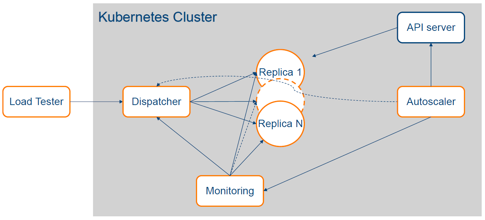

# Elastic ML Inference Serving
**Cloud Computing Course Project - TU Ilmenau**

A machine learning inference serving system with **custom autoscaling** capabilities for Kubernetes. This project implements elastic image classification using ResNet18 with intelligent queue-based load balancing and comprehensive monitoring, designed to outperform standard Kubernetes HPA.

## 🎯 Project Objectives

- **Understand cloud elasticity**: Learn how to react when services are under/over-utilized
- **Master Container-as-a-Service (CaaS)**: Hands-on experience with Kubernetes orchestration
- **Implement custom autoscaling**: Design autoscaler that outperforms Kubernetes HPA
- **Achieve performance targets**: Server-side latency < 0.5 seconds
- **Service Level Objectives**: Balance performance, cost, and resource utilization

## 🏗️ System Architecture




### 🔧 Core Components

1. **Load Tester**: Generates realistic workload patterns based on course-provided data
2. **Dispatcher**: Centralized queue for load balancing and request management  
3. **ML Inference Service**: ResNet18 image classification (CPU-only, 1 core per replica)
4. **Custom Autoscaler**: Queue-size based scaling that outperforms HPA
5. **Monitoring Stack**: Prometheus + Grafana for comprehensive observability

## 📋 Project Requirements

### ✅ Core Requirements
- [x] **CPU-Only Execution**: Models must run on CPU (no GPU)
- [x] **Performance Target**: Server-side latency < 0.5 seconds
- [x] **Minikube Deployment**: Run entire cluster locally
- [x] **Custom Autoscaler**: Outperform Kubernetes HPA
- [x] **Resource Constraints**: Each ML replica uses exactly 1 CPU core
- [x] **Queue-based Architecture**: Centralized dispatcher with load balancing

### 📊 Evaluation Criteria
- [x] **Comparative Analysis**: Custom autoscaler vs HPA (70% and 90% CPU targets)
- [x] **Metrics Comparison**: 99th percentile latency and CPU core usage
- [x] **Time-series Plots**: Visual comparison of performance metrics
- [x] **End-to-End Functionality**: All components working correctly

## 🚀 Quick Start

### Prerequisites

- **minikube** (v1.25+) 
- **kubectl**
- **Docker** 
- **Helm** (v3.0+)
- **Python 3.11+** (for load testing)

### 1. Minikube Setup

```bash
# Start minikube with required resources for course project
minikube start \
  --memory=8192 \
  --cpus=4 \
  --disk-size=20gb \
  --kubernetes-version=v1.28.0

# Enable essential addons
minikube addons enable metrics-server
minikube addons enable ingress

# Configure Docker environment
eval $(minikube docker-env)
```

### 2. Monitoring Stack (Prometheus + Grafana)

```bash
# Add Helm repositories
helm repo add prometheus-community https://prometheus-community.github.io/helm-charts
helm repo update

# Create monitoring namespace
kubectl create namespace monitoring

# Install Prometheus operator with course-specific configuration
helm install prometheus prometheus-community/kube-prometheus-stack \
  --namespace monitoring \
  --set prometheus.prometheusSpec.serviceMonitorSelectorNilUsesHelmValues=false \
  --set prometheus.prometheusSpec.podMonitorSelectorNilUsesHelmValues=false \
  --set prometheus.prometheusSpec.retention=7d \
  --set grafana.adminPassword=admin123 \
  --set grafana.persistence.enabled=true
```

**Access Monitoring:**
```bash
# Prometheus UI
kubectl port-forward -n monitoring svc/prometheus-operated 9090:9090 &

# Grafana UI (admin/admin123)
kubectl port-forward -n monitoring svc/prometheus-grafana 3000:80 &
```

### 3. Application Deployment

```bash
# Build Docker images (ensure minikube Docker environment is active)
docker build -t ml-app:latest -f ml_app/Dockerfile .
docker build -t dispatcher-app:latest -f dispatcher/Dockerfile .
docker build -t autoscaler:latest -f custom_autoscaler/Dockerfile .

# Create service account for autoscaler
kubectl create serviceaccount python-client-sa

# Deploy all components
kubectl apply -f ml_app/ml-app-deployment.yaml
kubectl apply -f ml_app/ml-app-servicemonitor.yaml
kubectl apply -f dispatcher/dispatcher-deployment.yaml
kubectl apply -f dispatcher/dispatcher-servicemonitor.yaml
kubectl apply -f custom_autoscaler/autoscaler-role.yaml
kubectl apply -f custom_autoscaler/autoscaler-deployment.yaml
```

### 4. Load Testing Setup

```bash
# Install course-provided load tester
pip install git+https://github.com/reconfigurable-ml-pipeline/load_tester

# Download sample images (or use your own ImageNet samples)
git clone https://github.com/EliSchwartz/imagenet-sample-images.git

# Update image directory path in load_tester.py
# Set endpoint to dispatcher service (port-forward for testing)
kubectl port-forward svc/dispatcher-service 8001:8001 &

# Run load test with course workload pattern
python load_tester.py
```

## 🔬 Experimental Evaluation

### Performance Comparison Protocol

As required by the course, run three experiments to compare autoscaling approaches:

1. **Custom Autoscaler Experiment**
2. **HPA with 70% CPU Target**  
3. **HPA with 90% CPU Target**

```bash
# Deploy HPA configurations (alternative to custom autoscaler)
kubectl apply -f hpa-70-deployment.yaml  # For 70% CPU experiment
# OR
kubectl apply -f hpa-90-deployment.yaml  # For 90% CPU experiment

# Run experiments and collect metrics:
# - 99th percentile latency
# - CPU core usage over time
# - Queue size variations
# - Scaling events timeline
```

### 📈 Metrics Collection

**Key Metrics to Track:**
- `dispatcher_queue_size` - Queue length over time
- `dispatcher_response_time_seconds` - End-to-end latency
- `ml_app_cpu_usage_percent` - CPU utilization per replica
- Pod scaling events and timing

**Expected Results:**
- Custom autoscaler should demonstrate better latency performance
- More efficient resource utilization than HPA
- Faster response to workload changes

## 🎛️ Custom Autoscaler Design

The custom autoscaler implements **queue-size based scaling** with the following logic:

```python
# Core scaling algorithm
if queue_size == 0:
    desired_replicas = MIN_REPLICAS
elif queue_size > DESIRED_QSIZE:
    desired_replicas = ceil(current_replicas * (queue_size / DESIRED_QSIZE))
else:
    desired_replicas = max(MIN_REPLICAS, ceil(current_replicas * (queue_size / DESIRED_QSIZE)))
```

**Key Parameters:**
- **Target Queue Size**: 50 requests
- **Min/Max Replicas**: 1-6 replicas
- **Cooldown Period**: 150 seconds
- **Poll Interval**: 15 seconds
- **Scaling Trigger**: Queue size deviation from target

## 📊 Monitoring Dashboard Setup

### Grafana Dashboard Panels

Create dashboards with the following visualizations:

1. **Queue Size Over Time** - Primary scaling trigger
2. **Response Latency (99th percentile)** - Performance metric
3. **CPU Utilization** - Resource efficiency
4. **Pod Count Timeline** - Scaling behavior
5. **Request Throughput** - Load patterns
6. **Memory Usage** - Resource monitoring

### Sample Queries

```prometheus
# Queue size metric
dispatcher_queue_size{job="dispatcher-service"}

# 99th percentile latency
histogram_quantile(0.99, rate(dispatcher_response_time_seconds_bucket[5m]))

# CPU utilization average
avg(ml_app_cpu_usage_percent) by (pod)
```

## 🔧 Configuration

### Environment Variables

```bash
# Dispatcher Configuration
ML_SERVICE_URL=http://ml-app-service:8000
PORT=8001

# Custom Autoscaler Settings  
PROMETHEUS_URL=http://prometheus-operated.monitoring.svc:9090
DEPLOYMENT_NAME=ml-app-deployment
DESIRED_QSIZE=50
MIN_REPLICAS=1
MAX_REPLICAS=6
```

### Resource Specifications

```yaml
# ML App Resource Requirements (per course specification)
resources:
  requests:
    cpu: 1          # Exactly 1 CPU core per replica
    memory: 1Gi
  limits:
    cpu: 1          # Enforce CPU limit
    memory: 1Gi
```

## 🐛 Troubleshooting

### Common Issues

1. **Images not found in minikube:**
   ```bash
   eval $(minikube docker-env)
   docker images | grep -E "(ml-app|dispatcher|autoscaler)"
   ```

2. **Custom metrics not appearing:**
   ```bash
   kubectl get servicemonitor
   kubectl describe servicemonitor dispatcher-monitor
   ```

3. **Autoscaler not scaling:**
   ```bash
   kubectl logs -l app=autoscaler -f
   kubectl describe clusterrolebinding autoscaler-role-binding
   ```

4. **Load tester connection issues:**
   ```bash
   kubectl port-forward svc/dispatcher-service 8001:8001
   curl http://localhost:8001/  # Test dispatcher connectivity
   ```

### Performance Optimization

```bash
# Monitor resource usage
kubectl top pods
kubectl top nodes

# Check pod readiness
kubectl get pods -w

# View scaling events
kubectl get events --sort-by=.metadata.creationTimestamp
```

## 📝 Project Deliverables

### 1. Implementation
- [ ] All components deployed and functional
- [ ] Custom autoscaler implementation
- [ ] Monitoring stack configured
- [ ] Performance targets achieved (< 0.5s latency)

### 2. Experimental Results
- [ ] Three experiment runs (Custom + HPA 70% + HPA 90%)
- [ ] 99th percentile latency comparison
- [ ] CPU core usage comparison  
- [ ] Time-series plots generated

### 3. Documentation
- [ ] System architecture documentation
- [ ] Autoscaler algorithm description
- [ ] Deployment instructions
- [ ] Performance analysis report

## 📅 Project Timeline

- **Project Submission**: July 1st, 2025
- **Presentations**: July 8th-15th, 2025

## 🎓 Academic Context

This project is part of the **Cloud Computing** course at **TU Ilmenau**, focusing on:
- **Elasticity in cloud services**
- **Container orchestration with Kubernetes**
- **Performance optimization and SLOs**
- **Custom autoscaling algorithm design**
- **Comparative analysis of scaling strategies**

---

## 📚 Additional Resources

- [Kubernetes HPA Documentation](https://kubernetes.io/docs/tasks/run-application/horizontal-pod-autoscale/)
- [Prometheus Monitoring](https://prometheus.io/docs/introduction/overview/)
- [Course Load Tester](https://github.com/reconfigurable-ml-pipeline/load_tester)
- [ImageNet Sample Images](https://github.com/EliSchwartz/imagenet-sample-images)

**Course**: Cloud Computing (SS25) - Prof. Dr. Boris Koldehofe  
**Institution**: Technische Universität Ilmenau  
**Department**: Computer Science and Automation - Distributed Systems Group